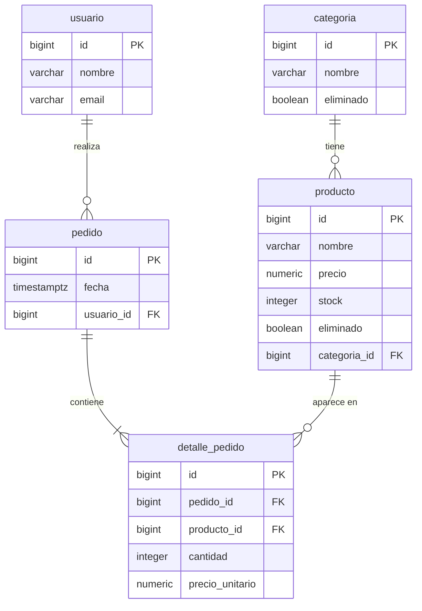

# Especificación del Esquema de Base de Datos — Food Store

**Proyecto:** Food Store  
**Trabajo Práctico:** TP3 — Base de Datos II  
**Motor:** PostgreSQL 17  
**Fecha de elaboración:** 2026-08-27  
**Estado:** Borrador inicial

---

## 1. Convenciones Generales

| Convención | Regla aplicada |
|---|---|
| Nombres de tabla | Singular, `snake_case` (ej.: `detalle_pedido`) |
| Clave primaria | Columna `id`, tipo `BIGINT GENERATED ALWAYS AS IDENTITY` en toda tabla |
| Clave foránea | Columna con nombre `<tabla_referenciada>_id` (ej.: `usuario_id`, `pedido_id`) |
| Baja lógica | Columna `eliminado BOOLEAN NOT NULL DEFAULT FALSE`; `FALSE` = vigente, `TRUE` = dado de baja. Solo en entidades de catálogo: `categoria` y `producto` |
| Identificadores | Sin comillas dobles; minúsculas; sin abreviaturas ambiguas |
| Índices | Solo los generados automáticamente por `PRIMARY KEY` y `UNIQUE`; sin índices manuales adicionales |
| Tipos ENUM | No se usan. Sin tipos enumerados de ningún tipo |
| Auditoría | Sin columnas `created_at`, `updated_at` ni similares |
| Triggers | No forman parte de este esquema |
| Idempotencia | Cada tabla debe ir precedida de `DROP TABLE IF EXISTS … CASCADE` en el orden correcto antes de los `CREATE` |

---

## 2. Descripción de Tablas

### 2.1 `categoria`

Entidad de catálogo. Agrupa a los productos en categorías temáticas (ej.: bebidas, lácteos, panificados). Admite baja lógica porque una categoría puede dejar de estar vigente sin eliminar el historial de productos que la referenciaron.

| Columna | Tipo | Restricciones | Notas |
|---|---|---|---|
| `id` | `BIGINT GENERATED ALWAYS AS IDENTITY` | `PRIMARY KEY` | Clave primaria autogenerada. No editable por el usuario |
| `nombre` | `VARCHAR(80)` | `NOT NULL`, `UNIQUE` | Nombre de la categoría. La unicidad evita duplicados (ej.: dos filas "Bebidas") |
| `eliminado` | `BOOLEAN` | `NOT NULL`, `DEFAULT FALSE` | Baja lógica. `FALSE` = categoría vigente; `TRUE` = categoría discontinuada |

**Índices implícitos generados por PostgreSQL:**
- `categoria_pkey` sobre `id` (por `PRIMARY KEY`)
- `categoria_nombre_key` sobre `nombre` (por `UNIQUE`)

---

### 2.2 `usuario`

Registra las personas que realizan pedidos. No lleva baja lógica porque un usuario representa un hecho persistente del sistema (una persona que alguna vez compró): darlo de baja lógicamente distorsionaría el historial de pedidos asociados y no responde a ningún requerimiento de discontinuación de catálogo. Si en el futuro se requiere gestionar el ciclo de vida de cuentas, esa decisión se tomará en un trabajo posterior.

| Columna | Tipo | Restricciones | Notas |
|---|---|---|---|
| `id` | `BIGINT GENERATED ALWAYS AS IDENTITY` | `PRIMARY KEY` | Clave primaria autogenerada |
| `nombre` | `VARCHAR(120)` | `NOT NULL` | Nombre completo del usuario. No se exige unicidad (puede haber homónimos) |
| `email` | `VARCHAR(150)` | `NOT NULL`, `UNIQUE` | Dirección de correo. Funciona como identificador natural único del usuario |

**Índices implícitos generados por PostgreSQL:**
- `usuario_pkey` sobre `id` (por `PRIMARY KEY`)
- `usuario_email_key` sobre `email` (por `UNIQUE`)

---

### 2.3 `producto`

Entidad de catálogo. Representa un artículo disponible para la venta. Admite baja lógica porque un producto puede dejar de comercializarse sin que eso invalide los pedidos históricos que lo contienen.

| Columna | Tipo | Restricciones | Notas |
|---|---|---|---|
| `id` | `BIGINT GENERATED ALWAYS AS IDENTITY` | `PRIMARY KEY` | Clave primaria autogenerada |
| `nombre` | `VARCHAR(120)` | `NOT NULL` | Nombre del producto. No se exige unicidad a nivel de esquema |
| `precio` | `NUMERIC(10,2)` | `NOT NULL`, `CHECK (precio >= 0)` | Precio de lista actual. El `CHECK` impide precios negativos. La precisión `(10,2)` admite hasta 99.999.999,99 |
| `stock` | `INTEGER` | `NOT NULL`, `DEFAULT 0`, `CHECK (stock >= 0)` | Unidades disponibles. Por defecto un producto recién creado tiene stock cero. El `CHECK` impide valores negativos |
| `eliminado` | `BOOLEAN` | `NOT NULL`, `DEFAULT FALSE` | Baja lógica. `FALSE` = producto vigente; `TRUE` = producto discontinuado |
| `categoria_id` | `BIGINT` | `NOT NULL`, `REFERENCES categoria(id) ON DELETE RESTRICT` | FK a `categoria`. `ON DELETE RESTRICT` impide eliminar físicamente una categoría si tiene productos asociados (vigentes o no) |

**Índices implícitos generados por PostgreSQL:**
- `producto_pkey` sobre `id` (por `PRIMARY KEY`)

---

### 2.4 `pedido`

Registra la cabecera de un pedido realizado por un usuario. No lleva baja lógica ni columna de estado porque representa un hecho ocurrido en el sistema: la orden fue creada en un momento determinado y eso no se revierte. La gestión de estados (pendiente, confirmado, cancelado) no forma parte del alcance de este trabajo.

| Columna | Tipo | Restricciones | Notas |
|---|---|---|---|
| `id` | `BIGINT GENERATED ALWAYS AS IDENTITY` | `PRIMARY KEY` | Clave primaria autogenerada |
| `fecha` | `TIMESTAMPTZ` | `NOT NULL`, `DEFAULT now()` | Marca temporal con zona horaria del momento en que se registra el pedido. El `DEFAULT now()` permite insertar sin especificar fecha |
| `usuario_id` | `BIGINT` | `NOT NULL`, `REFERENCES usuario(id) ON DELETE RESTRICT` | FK a `usuario`. `ON DELETE RESTRICT` impide eliminar físicamente un usuario que tenga pedidos registrados |

**Índices implícitos generados por PostgreSQL:**
- `pedido_pkey` sobre `id` (por `PRIMARY KEY`)

---

### 2.5 `detalle_pedido`

Línea individual de un pedido. Cada fila representa un producto incluido en un pedido, con su cantidad y el precio vigente al momento de la compra. La combinación `(pedido_id, producto_id)` es única: un mismo producto no puede aparecer dos veces en el mismo pedido.

| Columna | Tipo | Restricciones | Notas |
|---|---|---|---|
| `id` | `BIGINT GENERATED ALWAYS AS IDENTITY` | `PRIMARY KEY` | Clave primaria autogenerada |
| `pedido_id` | `BIGINT` | `NOT NULL`, `REFERENCES pedido(id) ON DELETE CASCADE` | FK a `pedido`. `ON DELETE CASCADE`: si se elimina físicamente un pedido, sus líneas se eliminan en cascada |
| `producto_id` | `BIGINT` | `NOT NULL`, `REFERENCES producto(id) ON DELETE RESTRICT` | FK a `producto`. `ON DELETE RESTRICT` impide eliminar físicamente un producto que aparezca en algún detalle |
| `cantidad` | `INTEGER` | `NOT NULL`, `CHECK (cantidad > 0)` | Unidades del producto en esta línea. El `CHECK` exige al menos 1 unidad (`> 0`, no `>= 0`) |
| `precio_unitario` | `NUMERIC(10,2)` | `NOT NULL`, `CHECK (precio_unitario >= 0)` | Precio del producto al momento de la compra (desnormalizado). Ver justificación en §5.2 |

**Constraint único compuesto:**
- `UNIQUE (pedido_id, producto_id)` — un producto aparece como máximo una vez por pedido

**Índices implícitos generados por PostgreSQL:**
- `detalle_pedido_pkey` sobre `id` (por `PRIMARY KEY`)
- `detalle_pedido_pedido_id_producto_id_key` sobre `(pedido_id, producto_id)` (por `UNIQUE`)

---

## 3. Diagrama Entidad-Relación



**Lectura de cardinalidades:**

| Relación | Cardinalidad | Descripción |
|---|---|---|
| `categoria` → `producto` | Uno a muchos (cero o más) | Una categoría puede tener ningún o muchos productos; cada producto pertenece a exactamente una categoría |
| `usuario` → `pedido` | Uno a muchos (cero o más) | Un usuario puede tener ningún o muchos pedidos; cada pedido pertenece a exactamente un usuario |
| `pedido` → `detalle_pedido` | Uno a muchos (uno o más) | Un pedido tiene al menos una línea de detalle; cada línea pertenece a exactamente un pedido |
| `producto` → `detalle_pedido` | Uno a muchos (cero o más) | Un producto puede aparecer en ninguna o muchas líneas de detalle; cada línea referencia exactamente un producto |

---

## 4. Orden de Creación y Destrucción

El orden respeta las dependencias de claves foráneas: primero se crean las tablas referenciadas y último las que referencian a otras.

### Orden de CREATE

```
1. categoria
2. usuario
3. producto          (depende de categoria)
4. pedido            (depende de usuario)
5. detalle_pedido    (depende de pedido y producto)
```

### Orden de DROP

Inverso al de creación. Las tablas que tienen FK hacia otras deben eliminarse antes que las referenciadas. El uso de `CASCADE` en los `DROP TABLE IF EXISTS` cubre referencias adicionales, pero el orden explícito es la práctica correcta.

```
1. detalle_pedido    (referencia a pedido y producto)
2. pedido            (referencia a usuario)
3. producto          (referencia a categoria)
4. usuario
5. categoria
```

El script SQL deberá iniciar con los cinco `DROP TABLE IF EXISTS … CASCADE` en ese orden antes de cualquier `CREATE TABLE`.

> **Advertencia de uso.** Estos `DROP` eliminan las tablas con todo su contenido. El script está pensado para aplicarse **una sola vez, sobre una base recién creada y vacía**. Una vez ejecutada la carga masiva (~670.000 filas), reejecutar este script destruye todos los datos generados sin aviso previo. Si hiciera falta volver a aplicarlo, se crea una base nueva; no se reejecuta sobre una base ya poblada..

---

## 5. Justificación de Decisiones de Diseño

### 5.1 Baja lógica solo en entidades de catálogo

La columna `eliminado` se incluye únicamente en `categoria` y `producto` porque son entidades de catálogo: representan cosas que pueden dejar de estar vigentes (una categoría que se descontinúa, un producto que se deja de vender) sin que eso invalide el historial de transacciones que las mencionan.

`usuario` y `pedido` no son catálogo: registran hechos ocurridos. Un usuario es una persona que en algún momento interactuó con el sistema; un pedido es una transacción que sucedió en un instante de tiempo. Aplicar baja lógica sobre hechos históricos no tiene semántica clara y distorsionaría las consultas de historial. Si en el futuro el negocio requiere gestionar el ciclo de vida de cuentas de usuario, esa decisión se tomará de forma explícita y documentada en un trabajo posterior.

### 5.2 Desnormalización de `precio_unitario` en `detalle_pedido`

El `precio` almacenado en `producto` es el precio de lista actual. Este valor puede cambiar a lo largo del tiempo: un producto puede aumentar, bajar de precio o incluso discontinuarse.

Si `detalle_pedido` no almacenara el precio al momento de la compra y se leyera directamente de `producto.precio`, cualquier modificación posterior del precio de lista alteraría retroactivamente el valor de todos los pedidos históricos que contienen ese producto. Eso haría imposible calcular correctamente el total de un pedido pasado.

La columna `precio_unitario` en `detalle_pedido` es, por lo tanto, una desnormalización deliberada y necesaria: captura el precio vigente en el instante de la transacción y lo preserva inmutable junto al pedido. Es un patrón estándar en esquemas de comercio electrónico.

### 5.3 Ausencia de índices manuales

El esquema no define ningún índice más allá de los generados automáticamente por `PRIMARY KEY` y `UNIQUE`. Esta decisión es estructural al Trabajo Práctico 3: el objetivo del TP es medir el rendimiento de las consultas sobre tablas sin índices, identificar los cuellos de botella, y luego crear los índices necesarios midiendo la mejora obtenida. Definir índices en el esquema inicial contaminaría esa medición de base. Los índices se especificarán y crearán en una etapa posterior del trabajo, una vez realizada la medición inicial.

---

## 6. Notas sobre el Flujo de Datos

Esta sección describe el ciclo de vida típico de un pedido dentro del esquema.

**1. Precondiciones**

Antes de poder registrar un pedido deben existir al menos:
- Una o más filas en `categoria` (con `eliminado = FALSE`).
- Una o más filas en `producto` (con `eliminado = FALSE` y `stock >= 1`).
- Una fila en `usuario` correspondiente al comprador.

**2. Creación del pedido (cabecera)**

Se inserta una fila en `pedido` con el `usuario_id` del comprador. El campo `fecha` toma el valor de `now()` automáticamente si no se especifica. En este punto el pedido existe pero no tiene líneas.

**3. Carga de líneas (detalle)**

Por cada producto que el usuario desea comprar se inserta una fila en `detalle_pedido` con:
- `pedido_id`: referencia al pedido recién creado.
- `producto_id`: referencia al producto elegido.
- `cantidad`: unidades solicitadas (mínimo 1).
- `precio_unitario`: precio de lista tomado de `producto.precio` en ese instante y copiado en la línea.

La constraint `UNIQUE (pedido_id, producto_id)` garantiza que un producto no aparezca duplicado dentro del mismo pedido.

**4. Consulta del total de un pedido**

El total de un pedido se calcula sumando `cantidad * precio_unitario` de todas las filas de `detalle_pedido` que corresponden al `pedido_id`. El resultado es siempre el total histórico correcto, independientemente de cambios posteriores en `producto.precio`.

**5. Consulta de catálogo vigente**

Al listar productos disponibles para la venta, se filtra `WHERE eliminado = FALSE` en `producto` y en `categoria`. Productos o categorías con `eliminado = TRUE` no se ofrecen al usuario, pero sus referencias en `detalle_pedido` histórico permanecen intactas.

**6. Dependencias al eliminar datos**

- Eliminar físicamente un `pedido` elimina en cascada todas sus filas en `detalle_pedido` (`ON DELETE CASCADE`).
- No es posible eliminar físicamente un `usuario` que tenga pedidos, ni un `producto` o `categoria` que estén referenciados en `detalle_pedido` (`ON DELETE RESTRICT`). Para dar de baja una entidad de catálogo se usa la baja lógica (`eliminado = TRUE`).

---

## 7. Volumen de Datos Previsto

Las siguientes cifras corresponden al conjunto de datos que generará el script de carga masiva del TP3. Se documentan aquí únicamente para que quien diseñe el esquema y las consultas tenga presente la escala a la que va a operar.

> **Nota importante:** la generación de datos de carga masiva NO es parte de esta especificación. Este apartado es solo referencia de volumen; el script de carga se especificará e implementará en una etapa separada del trabajo.

| Tabla | Filas previstas | Observaciones |
|---|---|---|
| `categoria` | 10 – 15 | Conjunto pequeño y fijo; representa las categorías del catálogo |
| `usuario` | 20.000 | Carga única al inicio |
| `producto` | 50.000 | Distribuidos de forma pareja entre las categorías existentes (aprox. 3.300 – 5.000 productos por categoría) |
| `pedido` | 200.000 | Distribuidos entre los 20.000 usuarios |
| `detalle_pedido` | ~400.000 | Entre 1 y 3 líneas por pedido; promedio esperado: 2 líneas |

**Implicaciones para el esquema:**

- Con 400.000 filas en `detalle_pedido` y sin índices manuales, los `JOIN` entre `pedido`, `detalle_pedido` y `producto` implicarán escaneos secuenciales completos (`Seq Scan`). Esto es intencional en la fase de medición inicial del TP.
- La columna `fecha` en `pedido` (200.000 filas con `TIMESTAMPTZ`) es candidata natural a índice en la fase posterior; lo mismo aplica a `categoria_id` en `producto`, a `usuario_id` en `pedido` y a `producto_id` en `detalle_pedido`. **`pedido_id` en `detalle_pedido` NO es candidato:** la restricción `UNIQUE (pedido_id, producto_id)` ya genera un índice cuya primera columna es `pedido_id`, por lo que las búsquedas por esa columna ya están cubiertas. `producto_id`, en cambio, es la segunda columna del índice compuesto y no puede aprovecharse por sí sola.

---

## 8. Alcance Explícito del Esquema

El siguiente listado documenta elementos que fueron considerados y descartados deliberadamente. Su ausencia no es un olvido: es una decisión de diseño alineada con los requerimientos del TP3.

| Elemento excluido | Motivo |
|---|---|
| Índices manuales (`CREATE INDEX`) | El TP requiere medir rendimiento sin índices primero. Los índices se crean en la etapa de optimización, después de la medición de base |
| Tipos `ENUM` | Añaden rigidez al esquema sin aportar valor en este contexto; los valores categóricos se manejan con tablas de catálogo (`categoria`) |
| Columnas de auditoría (`created_at`, `updated_at`) | No forman parte de los requerimientos del TP3; agregan ruido a las mediciones de rendimiento |
| `Triggers` | No forman parte del alcance de este trabajo; toda lógica de negocio queda fuera del motor en esta etapa |
| Columna de estado en `pedido` (pendiente, confirmado, cancelado) | El TP no modela el ciclo de vida del pedido; solo registra que ocurrió |
| Baja lógica en `usuario` | `usuario` registra hechos (personas que interactuaron con el sistema), no entradas de catálogo vigentes o discontinuadas |
| Baja lógica en `pedido` | `pedido` registra una transacción ocurrida en el tiempo; no tiene semántica de vigencia |
| Columna `stock` con control transaccional | El esquema define el campo `stock` en `producto` pero no implementa lógica de decremento automático; eso requeriría triggers o lógica de aplicación que están fuera del alcance |
| Tablas adicionales (dirección, método de pago, etc.) | El alcance del TP3 se cubre con estas cinco tablas; no se agregan entidades fuera de ese conjunto |

---

*Fin del documento de especificación.*

